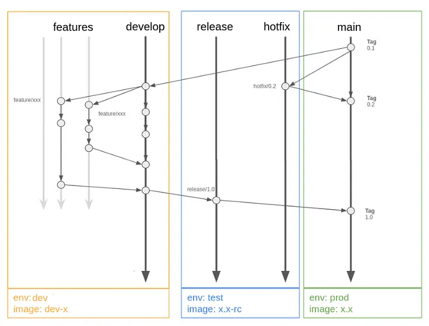

# P2P DevOps Assessment

This repository contains the infrastructure and application code for deploying a web application using Kubernetes.
It's managed through ArgoCD for GitOps, and provisioned using Terraform.

## Structure

- **`.github/`**: Contains PR template and release.yml
- **`.github/workflows/`**: GithubActions to manage CI and CD using.
- **`charts/argocd-apps`**: Helm chart for ArgoCD Apps and AppSets.
- **`charts/cluster-bootstrap`**: Helm chart for the required applications (e.g ALB Controller, External DNS, etc).
- **`charts/webapp`**: Helm chart for the web application.
- **`terraform`**: Terraform configurations for provisioning infrastructure onA AWS and setting up ArgoCD.
- **`Dockerfile`**: Dockerfile for building the web application's container image.
- **`main.go`**: The application source file.
- **`main_test.go`**: The application test source file.

## Prerequisites

To deploy this project, ensure you have the following installed:

- Access to a Kubernetes cluster
- Terraform
- Make
- Docker
- GitHub CLI

## Getting Started

### Deploying with Terraform

1. **Initialize Terraform**

   Navigate to the `terraform/` directory:

   ```sh
   terraform init
   terraform apply
   ```

## Development

For local development, build the Docker container and perform GET on port 8080:

```sh
make build && make
curl localhost:8080
```

Run and test the application locally:

```sh
go test -v
go run main.go
```

### CI-CD - GitFlow



###### Long-lived branches

- `origin/main`
   - Always reflects a production-ready state.
- `origin/develop`
   - Always reflects a state with the latest delivered development changes for the next release.

##### Release Flow

1. Go to `develop` branch and create a `feature/*` branch regarding your change
```bash
git checkout -b feature/update-code
```
2. Update the code and create PR to `develop` branch
   1. It will run unit tests
3. After that, you have to merge. The pipeline will execute:
   1. Run unit tests
   2. Run vulnerability checks
   3. Build the development new image
   4. Deploy in `dev`
4. After check in `dev`, now you need to create a Release Candidate to be validated in a pre-prod environment
   1. From `develop` branch follow the steps:
      1. Create a ***release*** PR (This PR will be executed to `master`):
      - The script will get the latest release version, calculate the release and branch name
      ```bash
      make release
      ```
   2. Pipeline will:
      1. Run unit tests
      2. Run vulnerability checks
      3. Build the new release candidate image
      4. Deploy in `stg` (pre-prod)
   3. After check in `stg`, approve the merge and deploy in production
5. In Production the Pipeline will trigger:
   1. Run unit tests
   2. Run vulnerability checks
   3. Build the new release candidate image
   4. Create a new Release on GitHub
   5. And create a PR to synchronize `master` with `develop`
6. Merge the PR creted

##### Hotfix Flow

1. Go to `master` branch and run:
- The Script will create a `hotfix/*` with any name that you choose and calculate hotfix version
```bash
make hotfix
```
2. Then, do your modification and push. It will deploy your change into non-prod environment performing the same checks as in RC pipeline
3. After that, merge and a new release will be created and deployed in prod
## Tech Debts
- Manage ArgoCD secrets using a secret manager/vault
- Setup Ingress for ArgoCD
- Create IaC CI/CD pipeline
- Create exclusive application registry on ECR
- Set dynamically the hard-coded registries and  
- Move App of Apps setup to another repository.
- Implement Zero-trust 
- Create script to handle ***semver*** releases
- Create a S3 bucket and DynamoDB table to manage statefile and state lockfile
- Notify Deployment in a communication channel
- Implement pre-commit
- Create security polices to manage the cluster
- Sign container image with Cosign
- Cluster and App monitoring
- Setup Autoscaler tool (Karpenter or Autoscaler)


